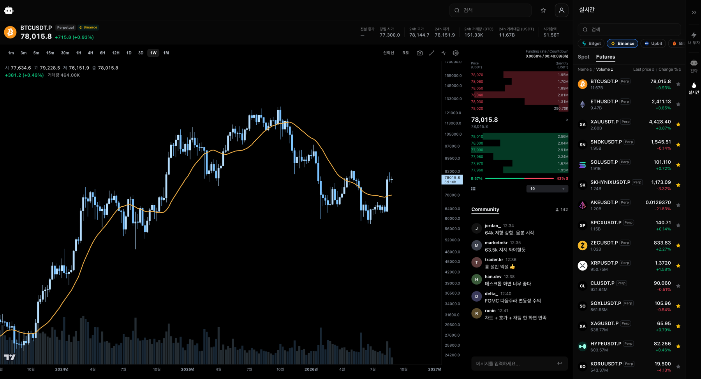

# Bubot

암호화폐 시세·차트·호가를 보고 거래소 계좌를 Read-only로 확인하는 웹 앱이다. Desktop 웹과 Mobile(PWA) 두 화면을 하나의
React 앱으로 제공하고, Spring Boot API가 거래소 시세를 중계하며 계좌를 조회한다. 봇 매매 엔진(하모닉·SMC·ABCD 패턴)은
`labs`에 보존해 두고 이후 모의투자로 노출할 예정이다.

> Portfolio Beta 단계다. 자동매매·Paper Trading·Backtest·Push·관리자 기능은 코드로 존재하지만 Beta 실행 경로에서 분리돼 있다.

## 화면



| 화면 | 경로 | 내용 |
|---|---|---|
| Desktop | `/web` | 차트(TradingView lightweight-charts)·호가·종목 목록·관심종목·내 투자 사이드바 |
| Mobile | `/mobile` | 마켓·차트·거래·자산 탭, PWA 설치 |

시세는 Binance·Bitget·Bithumb·Upbit·CoinGecko를 서버가 프록시하고, 실시간 캔들·호가는 서버가 거래소 WebSocket을 받아 STOMP로 중계한다.

## 구조

```text
Bubot/
├── apps/
│   ├── api/        Spring Boot · MyBatis · PostgreSQL — 인증(JWT), 시세 프록시·WebSocket 중계, 계좌 조회
│   │               (security · market/coin · member · trade / trading 프로필: paper · backtest · bot · push)
│   └── web/        React · TypeScript · Vite — app/{mobile,desktop} 두 진입점, chart/ hooks/ api/ shared/ 계층
├── shared/         하모닉·SMC·파동·피벗 계산 엔진, 전략 설정 스키마 (순수 TS, web과 worker가 공유)
├── labs/trading/   봇 매매 워커(worker/)와 Beta에서 분리한 자동매매 UI 보존본(web/) — Beta 비활성
├── ops/            기동·배포 스크립트, verify/ 회귀 검사와 baseline
├── docs/           목적·명령·Git 규칙·문서 운영 정본, architecture/
└── work-status/    현재 상태·결정·미결·Roadmap·Work Package PLAN
```

전체 폴더 트리와 각 폴더의 역할은 [docs/architecture/STRUCTURE.md](docs/architecture/STRUCTURE.md)에 있다.

의존 방향: `apps/web → shared`, `labs → shared`, `labs/trading/web → apps/web`(alias). `apps`는 `labs`를 import하지 않는다.
API의 자동매매·Paper·Push·Admin bean은 `@Profile("trading")`이라 기본 기동에서는 등록되지 않는다.

## 실행

요구: Node 22, Java 21, PostgreSQL. 로컬 설정 파일(`.env`, `apps/web/.env`, `apps/api/src/main/resources/application*.properties`)은
Git에 포함되지 않는다. 키 이름은 `apps/web/.env.example`을 참고한다.

```bash
# API (8081)
cd apps/api && ./gradlew bootRun

# Web — Mobile(vite.config.js 기본 5173), Desktop 5174
cd apps/web && npm ci && npm run dev        # Mobile → http://localhost:5173/mobile/
cd apps/web && npm run dev:desktop          # Desktop → http://localhost:5174/web/
# ops/front-end.sh는 Mobile을 5175로 띄운다(API CORS 허용 목록 기준)
```

검증 명령과 프로필 옵션은 [docs/COMMANDS.md](docs/COMMANDS.md)에 있다.

```bash
cd apps/web && npm test && npm run build && npm run build:desktop
cd apps/api && ./gradlew compileJava bootWar -x test
```

## 개발 규칙

- Git: GitHub Flow(`main` + 작업 브랜치), Squash and merge, 태그 기반 릴리즈 — [docs/GIT-WORKFLOW.md](docs/GIT-WORKFLOW.md)
- CI: PR과 `main` push에서 Web lint·test·build 2종·check:css, API test — [.github/workflows/ci.yml](.github/workflows/ci.yml)
- commit 전 `ops/check-secrets.sh`가 staged 파일의 secret 패턴을 검사한다 (`.githooks/pre-commit`, `git config core.hooksPath .githooks`)
- 현재 상태와 다음 할 일: [work-status/CURRENT.md](work-status/CURRENT.md) · 결정: [work-status/DECISIONS.md](work-status/DECISIONS.md)

## 기술

Java 21 · Spring Boot 3.5 · Spring Security(JWT) · MyBatis · PostgreSQL · WebSocket/STOMP ·
React 19 · TypeScript 6 · Vite 8 · Vitest · lightweight-charts 5 · Node 22

## 출처

팀 프로젝트(TPM, Spring MVC·JSP)에서 시작해 개인 프로젝트로 재구성했다. JSP 기반 잔해는 제거했고, 이 저장소는 정리된 코드에서
이력을 새로 시작했다. 연구·백테스트 자산은 별도 private 저장소에 보존한다.
